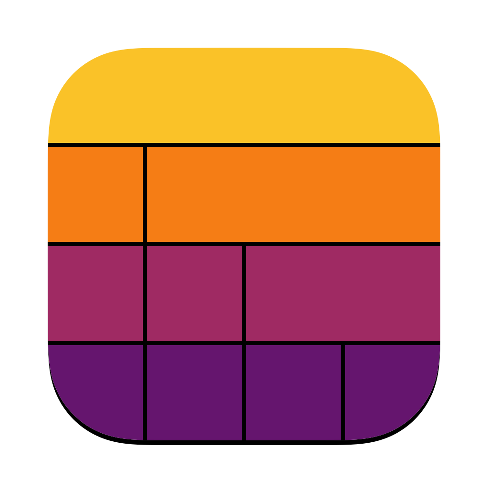
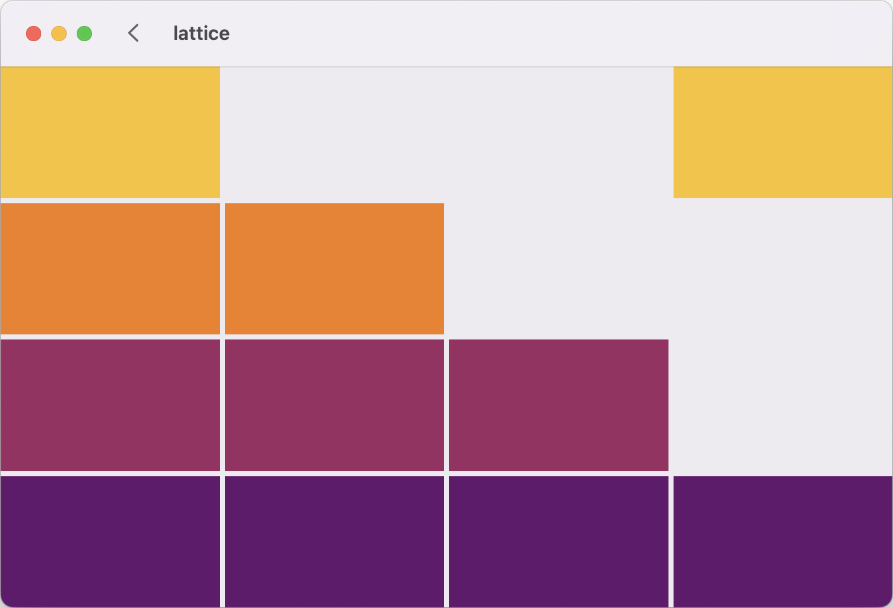

  

    
    
    

# Lattice
Demonstrates how to use SwiftUI GridViews and LazyGridViews in various and frequently encountered situations.

  

## More information
This is a companion repository for the Medium article: [SwiftUI GridViews: Detailed Guide](https://blog.eclypse.io/swiftui-gridviews-detailed-guide-00048547669b). Please refer to the blog for more information.

## Requirements

| XCode | 15.4 |
|:----------|:----------|
| Swift | 5 |

